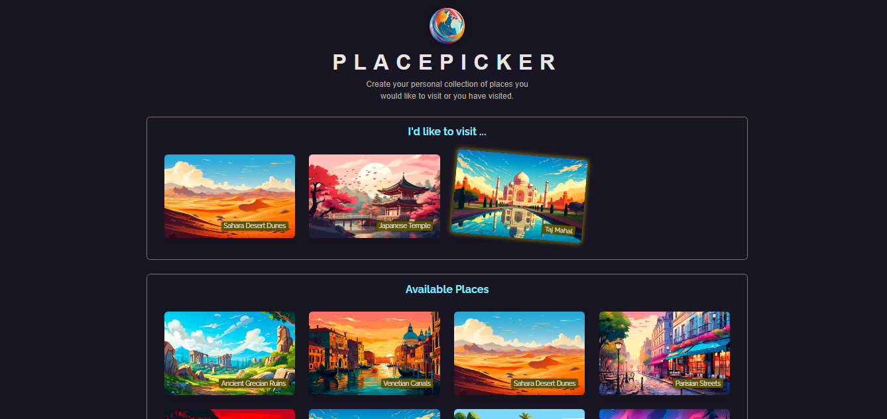
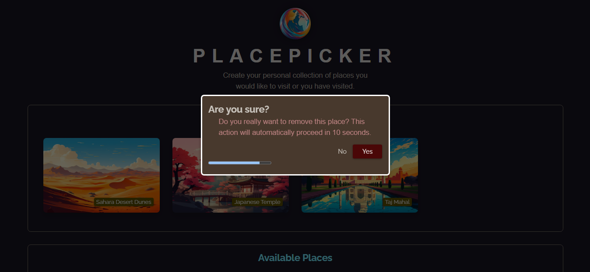

# PlacePicker

[](https://react.dev/)


PlacePicker is a React application that allows users to manage and organize their favorite places. Users can add locations they wish to visit, view nearby places sorted by distance, and delete entries with an intuitive modal confirmation system.

## Project Overview

### overview



### Delete Form



## Features

- **Add Places**: Select locations to add them to your personalized collection.
- **Distance-Based Sorting**: Sorts available places based on your current location using the Geolocation API.
- **Delete Places**: Remove places from your collection via a confirmation modal with a countdown timer.
- **Automatic Deletion**: Places are automatically deleted after 10 seconds unless the user cancels.
- **Local Storage Persistence**: Keeps your selected places saved between sessions.

## How It Works

1. View Available Places: The app automatically sorts available places based on your current location.

2. Add a Place: Click on an available place to add it to your collection.

3. Delete a Place: Select a place in your collection to remove it. Confirm or let it auto-delete in 10 seconds.

4. Persistent Data: Your selections will persist using **localStorage**.

## Project Structure

```
Elegant-Context
│
│      .gitignore
│      .vite.config
│      index.html
│      package-lock.json
│      package.json
│      README.md
│
│
└───public
│   deleteForm.png
│   logo.png
│   overview.png
│
└───src
    │   App.jsx
    │   index.jsx
    │   index.css
    │   datajs
    │   loc.js
    │
    ├───assets
    │      african-savanna.jpg
    │      amazon-river.jpg
    │      caribbean-beach.jpg
    │      desert-dunes.jpg
    │      forest-waterfall.jpg
    │      grand-canyon.jpg
    │      great-barrier-reef.jpg
    │      japanese-temple.jpg
    │      kerala-backwaters.jpg
    │      logo.png
    │      machu-picchu.jpg
    │      majestic-mountains.jpg
    │      northern-lights.jpg
    │      parisian-streets.jpg
    │      rainforest.jpg
    │      ruins.jpg
    │      taj-mahal.jpg
    │      venetian-canals.jpg
    │      victoria-falls.jpg
    │
    ├───components
    │      DeleteConfirmation.jsx
    │      Modal.jsx
    │      Places.jsx
    │      ProgressBar.jsx
    │
```

## Installation

To get started with the project locally:

1. Clone the repository:
   ```bash
   git clone https://github.com/SalahShallapy/Place-Picker.git
   ```
2. Navigate to the project directory:
   ```bash
   cd Place-Picker
   ```
3. Install dependencies:
   ```bash
   npm install
   ```
4. Run the project:

   ```bash
   npm run dev
   ```

## Contributing

Contributions are what make the open source community such an amazing place to learn, inspire, and create. Any contributions you make are **greatly appreciated**.

If you have a suggestion that would make this better, please fork the repo and create a pull request. You can also simply open an issue with the tag "enhancement".
Don't forget to give the project a star! Thanks!

1.  Fork the Project
2.  Create your Feature Branch (`git checkout -b feature/AmazingFeature`)
3.  Commit your Changes (`git commit -m 'Add some AmazingFeature'`)
4.  Push to the Branch (`git push origin feature/AmazingFeature`)
5.  Open a Pull Request

   <p align="right">(<a href="#top">back to top</a>)</p>
